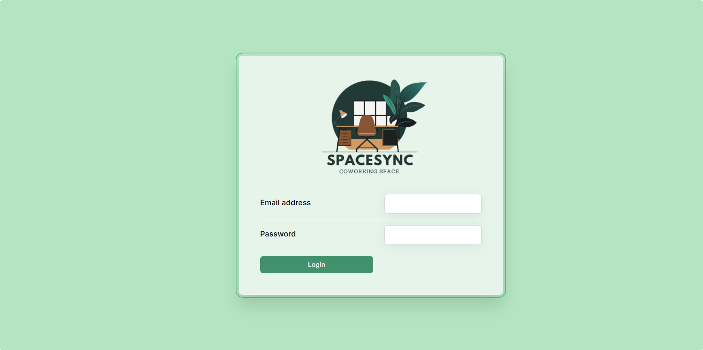
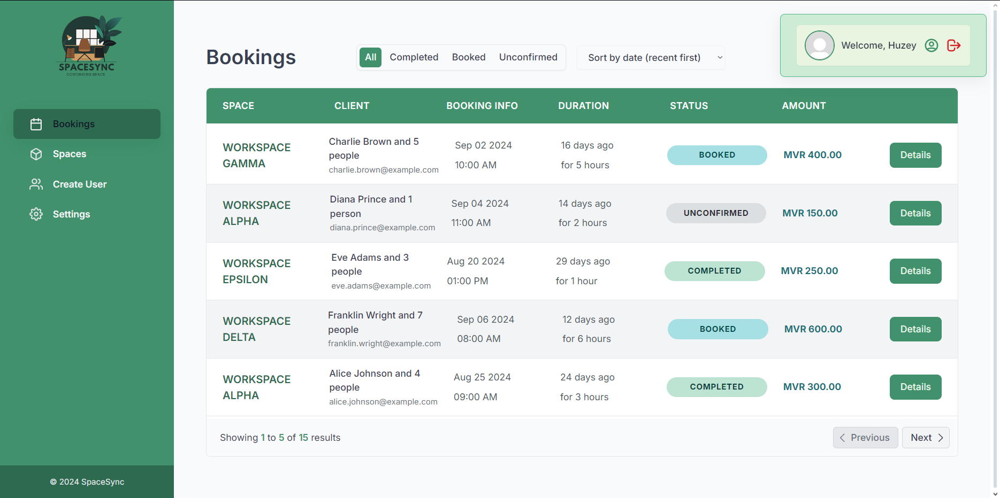
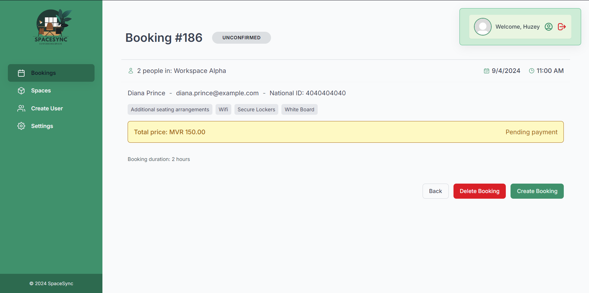
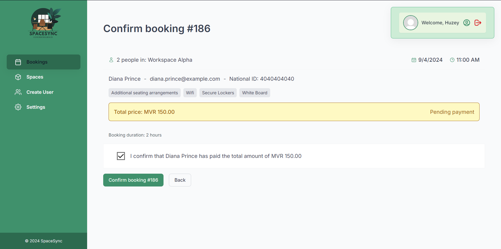
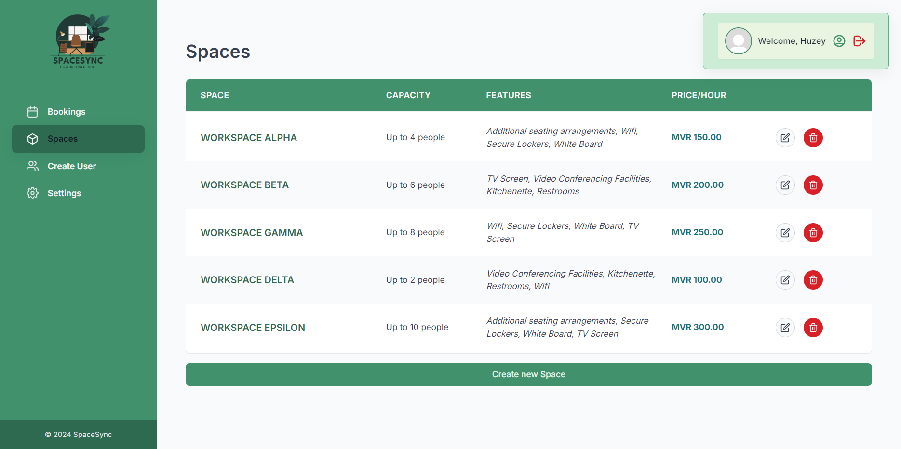
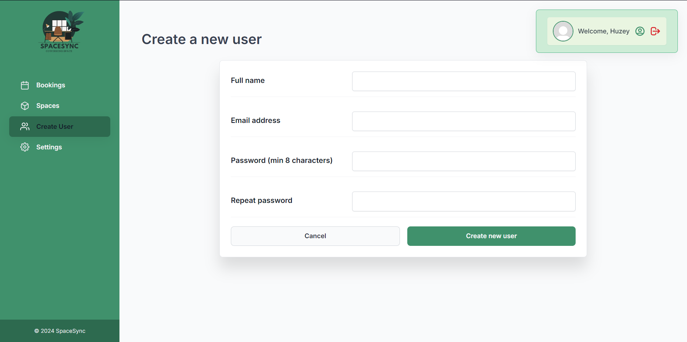
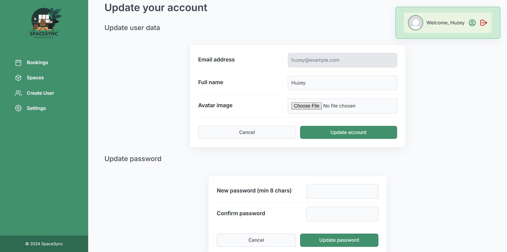

# SpaceSync

SpaceSync is a co-work space booking management web application designed to simplify the process of managing spaces, bookings, clients, and settings. The app provides a user-friendly interface for admins to manage the various aspects of co-work space bookings, ensuring efficient and streamlined operations.

### Credentials

email: huzey@example.com
password: 12345678

### Links

- **Live-url:** https://space-sync-azure.vercel.app
- **GitHub-repo:** https://github.com/huz3y/SpaceSync.git

## Features

- **User Management**: Create, update, and delete user accounts with ease.
- **Booking Management**: View booking details, confirm or delete bookings, and manage the booking lifecycle.
- **Space Management**: Create, edit, and delete spaces, each with customizable features and pricing.
- **Settings Management**: Configure global settings, such as minimum and maximum booking hours, and the maximum number of people allowed per booking.

## Pages Overview

### Booking Detail Page

The Booking Detail page provides a comprehensive overview of an individual booking. Admins can view the details of the booking, including the client's information, space booked, the number of people, duration, and the total price. Additionally, this page allows admins to perform actions such as confirming the booking, deleting it, or navigating back to the previous page.

### Create Booking Page

The Create Booking page is where new bookings are made. Admins can select a space, input the client's details, specify the date, time, and duration of the booking, and finalize the booking with the price calculation. The interface ensures that all required fields are filled out correctly before submission, making the booking process smooth and error-free.

### Spaces Page

The Spaces page is dedicated to managing the spaces available for booking. Admins can view a list of all spaces, along with their features and pricing. The page allows for the creation of new spaces, where admins can define the space's name, maximum capacity, price, and unique features. Existing spaces can be edited or deleted as needed, giving admins full control over the space offerings.

### Create User Page

The Create User page enables the admin to add new users to the system. Admins can enter the user's full name, email address, and set a password. This page ensures that all necessary details are provided before creating the user, helping maintain accurate and complete user records.

### Update User Page

The Update User page allows admins to modify existing user information. Admins can update the user's full name, email, and even their avatar image. This page is designed to keep user information up to date and ensures that any changes are reflected across the application.

### Settings Page

The Settings page provides a centralized place to configure the application's global settings. Admins can adjust parameters such as the minimum and maximum booking hours and the maximum number of people allowed per booking. These settings help tailor the application to the specific needs of the co-work space, ensuring that all bookings adhere to the desired rules and regulations.

## Getting Started

To get started with SpaceSync, follow the instructions below:

### Prerequisites

- **Node.js**: Ensure you have Node.js installed. You can download it from [nodejs.org](https://nodejs.org/).
- **npm**: npm is included with Node.js. Ensure you have npm installed by running `npm -v` in your terminal.

### Installation

1. **Clone the repository:**

   ```bash
   git clone https://github.com/huz3y/SpaceSync.git
   cd spacesync
   ```

2. **Install the dependencies:**
   ```bash
   npm install
   ```
3. **Start Development:**

   ```bash
   npm run dev
   ```

4. **Start Build process:**
   ```bash
   npm run build
   ```

### Screenshots








